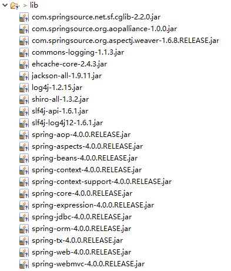

## Shiro与Spring简单集成

`Spring核心配置文件`

```xml
<?xml version="1.0" encoding="UTF-8"?>
<beans xmlns="http://www.springframework.org/schema/beans"
	xmlns:xsi="http://www.w3.org/2001/XMLSchema-instance"
	xsi:schemaLocation="http://www.springframework.org/schema/beans 
	http://www.springframework.org/schema/beans/spring-beans-3.0.xsd">
	
	<!-- 配置shiro的securityManager -->
	<bean id="securityManager"
		class="org.apache.shiro.web.mgt.DefaultWebSecurityManager">
		<property name="cacheManager" ref="cacheManager" />
		<!-- 
		shiro中session相关配置
		<property name="sessionMode" value="native" />
		 -->
		<property name="realm" ref="jdbcRealm" />
	</bean>
	
	<!-- shiro缓存管理器，采用第三方缓存 -->
	<bean id="cacheManager" class="org.apache.shiro.cache.ehcache.EhCacheManager">
		<!-- 
		采用bean方式，也可以采用指定类路径下的xml文件
		<property name="cacheManager" ref="ehCacheManager"/>
		 -->
		<property name="cacheManagerConfigFile" value="classpath:ehcache.xml"/>
	</bean>
	<bean id="jdbcRealm" class="com.heiketu.shiro.realm.ShiroRealm">
	</bean>

	<!-- shiro生命周期Post处理器 -->
	<bean id="lifecycleBeanPostProcessor" class="org.apache.shiro.spring.LifecycleBeanPostProcessor" />

	<bean class="org.springframework.aop.framework.autoproxy.DefaultAdvisorAutoProxyCreator"
		depends-on="lifecycleBeanPostProcessor" />
	<bean
		class="org.apache.shiro.spring.security.interceptor.AuthorizationAttributeSourceAdvisor">
		<property name="securityManager" ref="securityManager" />
	</bean>

	<bean id="secureRemoteInvocationExecutor"
		class="org.apache.shiro.spring.remoting.SecureRemoteInvocationExecutor">
		<property name="securityManager" ref="securityManager" />
	</bean>

	<!-- shiro权限过滤:id要和web.xml中的ShiroFilter的filter-name一致 -->
	<bean id="shiroFilter"
		class="org.apache.shiro.spring.web.ShiroFilterFactoryBean">
		<property name="securityManager" ref="securityManager" />
		<!-- 登录页面 -->
		<property name="loginUrl" value="/login.jsp" />
		<!-- 登录成功页面 -->
		<property name="successUrl" value="/success.jsp" />
		<!-- 无权限页面 -->
		<property name="unauthorizedUrl" value="/unauthorized.jsp" />
		<property name="filterChainDefinitions">
			<value>
				<!-- anon:表示可以匿名访问 -->
				/login.jsp = anon
				<!-- authc:表示需要授权才可以访问 -->
				/** = authc
			</value>
		</property>
	</bean>

</beans>
```

`SpringMVC配置文件`

```xml
<?xml version="1.0" encoding="UTF-8"?>
<beans xmlns="http://www.springframework.org/schema/beans"
	xmlns:xsi="http://www.w3.org/2001/XMLSchema-instance" 
	xmlns:context="http://www.springframework.org/schema/context"
	xmlns:mvc="http://www.springframework.org/schema/mvc"
	xsi:schemaLocation="http://www.springframework.org/schema/beans 
	http://www.springframework.org/schema/beans/spring-beans.xsd
        http://www.springframework.org/schema/context 
        http://www.springframework.org/schema/context/spring-context.xsd
        http://www.springframework.org/schema/mvc 
        http://www.springframework.org/schema/mvc/spring-mvc.xsd">
	<!-- 配置自动扫描的包 -->
	<context:component-scan base-package="common"></context:component-scan>
	<context:component-scan base-package="controller"></context:component-scan>
	<context:component-scan base-package="service"></context:component-scan>
	
	<!-- JSON返回乱码问题 -->
	<mvc:annotation-driven></mvc:annotation-driven>
	<!-- 启用默认servlet控制器[资源] -->
	<mvc:default-servlet-handler/>
	<!-- ./JSON返回乱码问题 -->
	
	<!-- 配置视图解析器 如何把handler 方法返回值解析为实际的物理视图 -->
	<bean class="org.springframework.web.servlet.view.InternalResourceViewResolver">
		<property name="prefix" value="/"></property>
		<property name="suffix" value=".jsp"></property>
	</bean>
</beans>
```

`web.xml文件中添加ShiroFilter`

```xml
<?xml version="1.0" encoding="UTF-8"?>
<web-app xmlns:xsi="http://www.w3.org/2001/XMLSchema-instance"
	xmlns="http://java.sun.com/xml/ns/javaee"
	xsi:schemaLocation="http://java.sun.com/xml/ns/javaee http://java.sun.com/xml/ns/javaee/web-app_3_0.xsd"
	id="WebApp_ID" version="3.0">
	<display-name>shiroAndspring</display-name>
	<welcome-file-list>
		<welcome-file>index.jsp</welcome-file>
	</welcome-file-list>


	<!-- ShiroFilter -->
	<filter>
		<filter-name>shiroFilter</filter-name>
		<filter-class>org.springframework.web.filter.DelegatingFilterProxy</filter-class>
		<init-param>
			<param-name>targetFilterLifecycle</param-name>
			<param-value>true</param-value>
		</init-param>
	</filter>

	<filter-mapping>
		<filter-name>shiroFilter</filter-name>
		<url-pattern>/*</url-pattern>
	</filter-mapping>
	
	<!-- SpringMVC前端控制器 -->
	<servlet>
		<servlet-name>spring-mvc</servlet-name>
		<servlet-class>org.springframework.web.servlet.DispatcherServlet</servlet-class>
		<init-param>
			<param-name>contextConfigLocation</param-name>
			<param-value>classpath:spring-mvc.xml</param-value>
		</init-param>
		<load-on-startup>1</load-on-startup>
	</servlet>
	
	<servlet-mapping>
		<servlet-name>spring-mvc</servlet-name>
		<url-pattern>/</url-pattern>
	</servlet-mapping>
	
	<!-- springWeb容器 -->
	<listener>
		<listener-class>org.springframework.web.context.ContextLoaderListener</listener-class>
	</listener>
	
	<!-- spring容器的配置文件 -->
	<context-param>
		<param-name>contextConfigLocation</param-name>
		<param-value>classpath:spring.xml</param-value>
	</context-param>
	
</web-app>
```

所需要Jar包如下:

